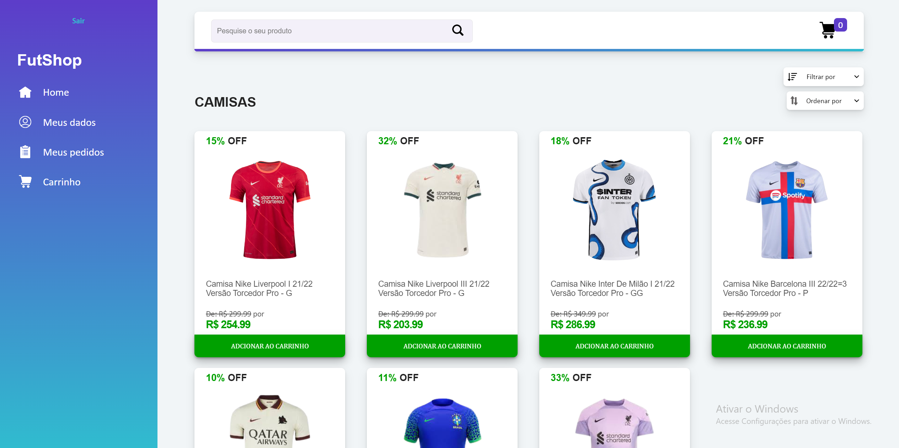
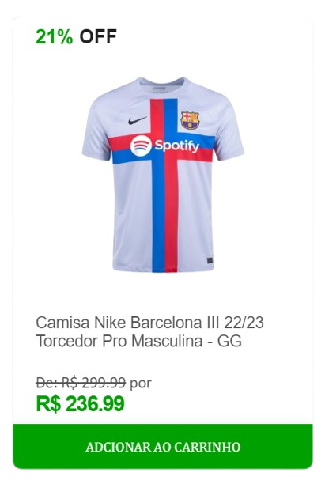
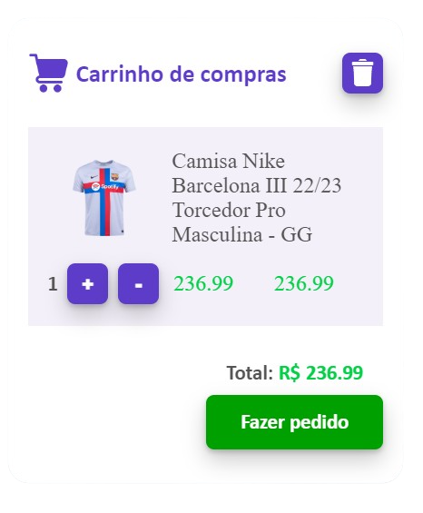
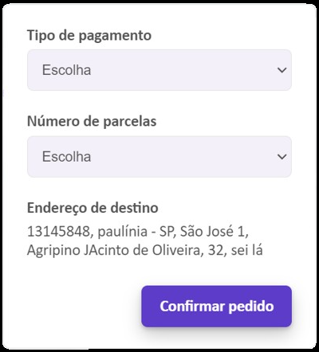
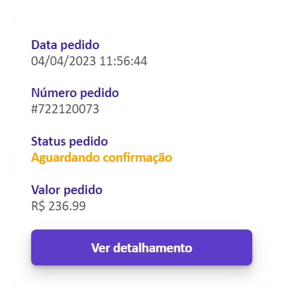
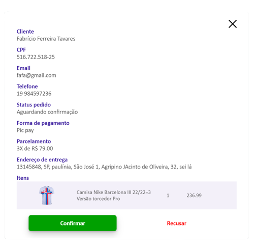

# Futshop 🛒

<h2>Sobre o projeto 🔎</h2>
Futshop é um site de vendas de produtos, criado com o intuito de facilitar a vida de pequenos vendedores, de forma que assim não precisem se preocupar com a frequente atualização dos dados de seu estoque ou a coleta de informações do cliente (informações de contato e envio).Até o momento este é meu projeto mais bem trabalhado.
  

<h2>Tecnologias utilizadas 💻</h2>
* Java (Spring Boot/Spring Security/Spring Data) 
* Javascript + JQuery 
* HTML + CSS 
* Banco de dados MySQL
  
 
<h2>Mecânica de funcionamento do site :hammer: </h2> 

<strong>1</strong> - O cliente cria sua conta passando seus dados de contato e endereço; 

<strong>2</strong> - Com sua conta criada, o cliente loga e adquire a possibilidade de adicionar/remover itens do seu carrinho; 

<strong>3</strong> - Com ao menos um item no carrinho, o cliente ganha direito a fazer um pedido, passando a forma de pagamento e o parcelamento;  

<strong>4</strong> - Com um pedido confirmado, o mesmo é gerado, salvo e exibido instantaneamente no menu administrativo; 

<strong>5</strong> - O administrador ao receber o pedido, pode aceitá-lo ou recusá-lo. Caso aceite, ele deverá através de algum dos dados de comunicação do cliente estabelecer contato com o mesmo, para lhe passar a cobrança selecionada. Caso rejeite, deverá devolver uma mensagem explicando o motivo. 

  
 
<h2>Ações de um usuário comum</h2> 
* Gerar carrinhos e pedidos.  
* Visualizar e editar dados pessoais.  
* Visualizar todos seus pedidos e seus detalhamentos. 
  
 
<h2>Ações de um usuário administrador</h2>
* Manipular os produtos do site (adição, edição e exclusão) e os pedidos dos clientes (confirmação ou rejeição). 
  
 
<h2>Segurança do site :lock:</h2> 
O projeto possui um sistema de tokens JWT, o que faz com que somente usuários logados possam acessar certas rotas e métodos, e somente usuários administradores possam acessar/controlar o menu administrativo. 
  

<h2>Passo a passo para rodar em seu PC </h2>
* Possua uma JDK 17 ou superior instalada em seu PC; 
* Baixe ou clone o projeto em seu PC; 
* Configure algum banco de dados MySQL, seja ele local ou de algum serviço externo (recomendo os do site RailWay) dentro do applications.properties. Para isso você precisa do 
host, nome, porta, usuario e senha do banco de dados; 
* Dê build ou compile no projeto usando alguma IDE (recomendo Intelij), para baixar todas as dependências; 
* Por fim, dê start na classe principal do projeto (FutshopApplication) e pronto, ele já funcionará.
  
 
<h2>Link video 📺</h2>
https://youtu.be/ljKxzoam1VA
  

<h2>Link site :zap:</h2>
https://futshop-nft.up.railway.app/
  

<h2>Autor :raising_hand:</h2>

| [ Fabrício Ferreira Tavares](https://github.com/fabricionft) | 
| :---: | 
